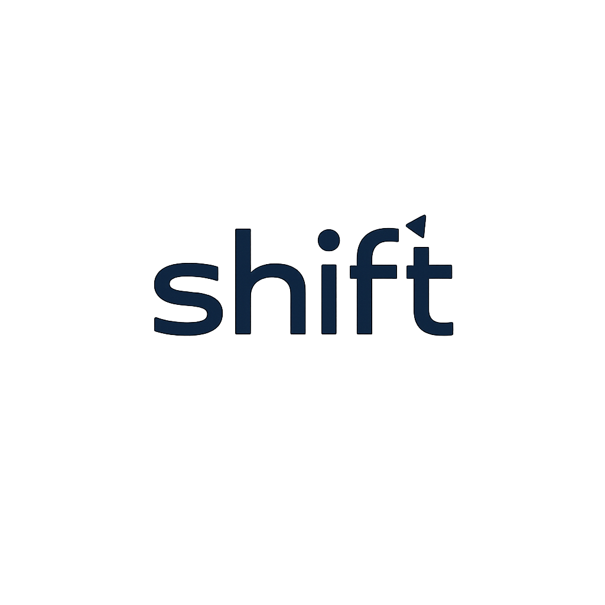

<div align="center">



# SHIFT 공식 웹사이트

**디지털헬스케어학부 학술동아리 SHIFT의 공식 웹**

[](https://shiftysdh.com)
[](https://react.dev)
[](https://vite.dev)
[](https://supabase.com)
[](https://vercel.com)

`main`에 push하면 1~2분 안에 https://shiftysdh.com 에 자동 배포됩니다.

</div>

---

## 주요 기능

| 영역 | 내용 |
|---|---|
| 🗓 **활동** | 관리자가 활동(프로젝트·스터디·세미나·행사)을 등록·수정하고, 모집 중 → 진행 중 → 완료로 상태 관리. 홍보 포스터 첨부, 구글폼 링크 또는 자유 안내문으로 신청 접수 |
| 👥 **참여 부원** | 활동마다 부원 명단에서 참여자 지정 → "현재 작업 중" 표시. 이름은 텍스트로 보존되어 졸업·탈퇴 후에도 아카이브에 남음 |
| 🏆 **마일리지** | Google Sheets에서 5분 주기 자동 동기화. 부원별 점수·등급(LV)·순위 + TOP3 리더보드 |
| 📰 **게시판** | 공지사항(상단 고정 핀), 뉴스레터(PDF), 자료실, 익명 건의함(운영진에게는 이름 표시 — 제출 화면에 명시) |
| 🔐 **계정** | 부원 명단에 등록된 이메일만 가입 가능(DB 트리거). 비밀번호 셀프 재설정, 프로필 사진·이름 변경 |
| 🗃 **아카이브** | 완료된 활동이 참여자 이름·포스터와 함께 자동 표시 |

## 기술 구성

```
방문자 ── React 19 + Vite 8 + react-router ── Vercel (shiftysdh.com)
                     │
                Supabase ── Postgres (RLS로 행 단위 보안)
                     │        Auth (부원 명단 기반 가입 제한)
                     │        Storage (포스터·프로필 사진·뉴스레터·자료)
                     │        SMTP: Resend (noreply@shiftysdh.com)
                     │
        Google Sheets ← Apps Script 5분 동기화 (부원·마일리지)
```

## 시작하기

```bash
git clone https://github.com/dhc-shift/shift-website.git
cd shift-website
npm install
cp .env.example .env    # Windows PowerShell: Copy-Item .env.example .env
npm run dev
```

`.env`에 넣을 공개 값 두 개는 운영진에게 받으세요.

```env
VITE_SUPABASE_URL=https://your-project.supabase.co
VITE_SUPABASE_PUBLISHABLE_KEY=sb_publishable_your_key
```

> ⚠️ `service_role` 키와 DB 비밀번호는 절대 `.env`, 소스 코드, 메신저에 올리지 마세요. `.env`는 Git에 올라가지 않습니다.

## 프로젝트 구조

```
src/
├── main.jsx            앱 조립 + 라우팅 + 데이터 로딩
├── supabase.js         Supabase 클라이언트
├── data.js             정적 콘텐츠 (메뉴, 아카이브 과거 기록 등)
├── styles.css          전체 스타일
├── components/         Header(프로필 드롭다운) · Footer · 공용 UI
└── pages/              페이지 1개 = 파일 1개
    ├── Home  About  Activities  Archive  Board  More
    ├── MyPage(프로필 수정)  LoginPage(+비밀번호 재설정)
    └── Admin           관리자: 활동·뉴스레터·일정·공지·자료·건의·회원
supabase/               DB 마이그레이션 (001 → 012 순서 실행)
google-apps-script/     시트 동기화 백업본 (원본은 시트의 Apps Script)
```

## 새 페이지 추가하는 법

1. `src/pages/`에 컴포넌트 파일 생성
2. `src/main.jsx`의 `<Routes>`에 `<Route>` 추가
3. 메뉴에 넣으려면 `src/data.js`의 `navItems`에 추가

## Google Sheets 동기화

- 시트 수정 → **최대 5분 후** DB 반영 → 웹은 새로고침 시 표시
- 트리거 설치(1회): 시트 → 확장 프로그램 → Apps Script → `installShiftSyncTrigger` 실행
- 안전장치: '인원 관리' 시트가 비어 있으면 동기화가 중단됩니다 (전체 삭제 방지)
- `google-apps-script/ShiftSupabaseSync.gs`는 백업본 — **수정하면 시트의 Apps Script에도 붙여넣어야 반영**

## 새 Supabase 프로젝트를 만들 때

SQL Editor에서 순서대로 실행:

```
setup.sql → 002 → 003 → 004 → 005 → 006(가입 제한) → 007(이름 자동 조회)
→ 008(프로필 수정) → 009(프로필 사진) → 010(활동) → 011(포스터) → 012(신청 안내문)
```

이후 첫 관리자로 가입하고 `promote-first-admin.example.sql`의 이메일을 바꿔 실행합니다.
Auth 설정: URL Configuration에 배포 도메인 등록, SMTP는 Resend 연결(시간당 발송 한도 상향 포함).

## 협업 규칙

1. 작업 전 **`git pull`**
2. 기능 단위 커밋, 메시지는 한 줄 요약
3. 같은 파일을 동시에 크게 수정하지 않도록 작업 범위 먼저 공유
4. **`npm run build` 통과 상태로만 push** (push = 즉시 배포임을 기억)
5. 비밀키·회원 명단·마일리지 원본은 저장소에 올리지 않기

---

<div align="center">
<sub>© 2026 SHIFT · 문의 <a href="mailto:shiftysdh@gmail.com">shiftysdh@gmail.com</a></sub>
</div>
